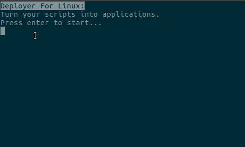

# ScriptDeployer
Turn your scripts like .py and .sh into application launchers (Linux Only!)

# Installation

Download the file called 'deployer.sh'
Command:

$ wget https://github.com/TellSpaceOfficial/ScriptDeployer/blob/master/deployer.sh

# Run the script

Run The script as following:
Command:

$ sh deployer.sh

## Important!

### Do not use ./deployer.sh for a better experience!

# Uage:

Just follow the directions by the program.

## For fun

You can use the deployer script to create a application for the deployer script!

# Using your applications:

Double click the .desktop file (.desktop extension not visable!) The file that has your icon on it.

# Important

You can not delete or move the original script file!

# Contact & Help

E-mail: edvard1807@gmail.com
Github: <a href="https://gituhb.com/Buscedv" target="blank"> @Buscedv </a>

Edvard Busck-Nielsen 2018
